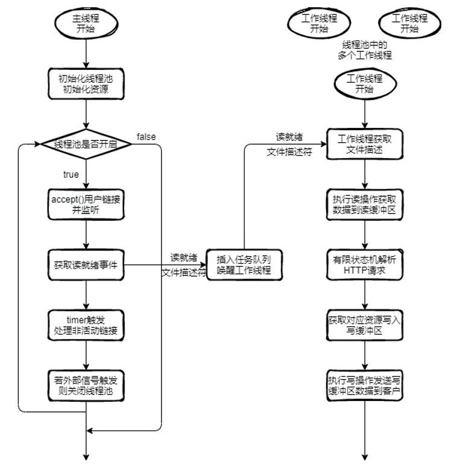

# Qver

利用 C++ 11 编写一个简单的Linux HTTP 服务器，主要用于网络编程练习和对个人静态博客的部署尝试

- 使用**非阻塞 socket** + **epoll** + **半同步/半反应堆模式** + **线程池**来处理客户连接
- 通过**有限状态机**处理 HTTP 请求报文（GET）



---

## 运行

测试环境：

- OS：Arch Linux on Windows 10 x86_64
- Kernel：5.10.43.3-microsoft-standard-WSL2
- CPU：Intel i7-8750H (12) @ 2.208GHz
- g++ (GCC)：11.1.0
- cmake version：3.21.2（最低要求：3.19.0）

（2021-9-14）尚未完成配置文件功能，请编辑`../src/http-event.cpp`中网站根目录`const char *doc_root`，将其设置为自己的相关路径

```
$ cd Qver
$ mkdir build && cd build
$ cmake -G "Unix Makefiles" ../
$ make
$ cd ..
$ ./Qver
```


---

## 相关文档

- [Qver - 用于练手的服务器程序 | xStack](http://www.xqmq.icu/posts/2be28fe1.html)
- [I/O多路复用 | xStack](http://www.xqmq.icu/posts/7ce262fd.html)
- [多进程编程 | xStack](http://www.xqmq.icu/posts/716f0d9b.html)
- [多线程编程 | xStack](http://www.xqmq.icu/posts/341a9d02.html)
- [C++11中的多线程 | xStack](http://www.xqmq.icu/posts/c838ae05.html)
- [C++11中的线程安全 | xStack](http://www.xqmq.icu/posts/6320f5a6.html)

---

## 待优化项目

- [ ] 通过配置文件来设定待监听的IP、端口，设置静态页面的相关路径
- [ ] 优化定时器结构，学习时间堆和时间轮相关概念
- [ ] 添加运行日志功能

